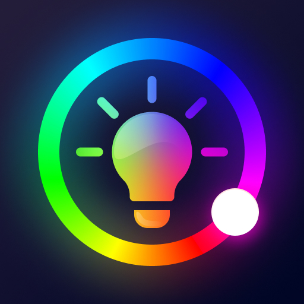
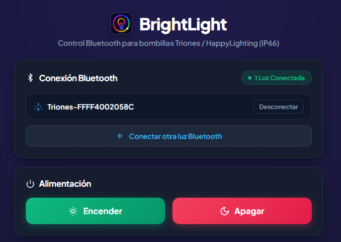
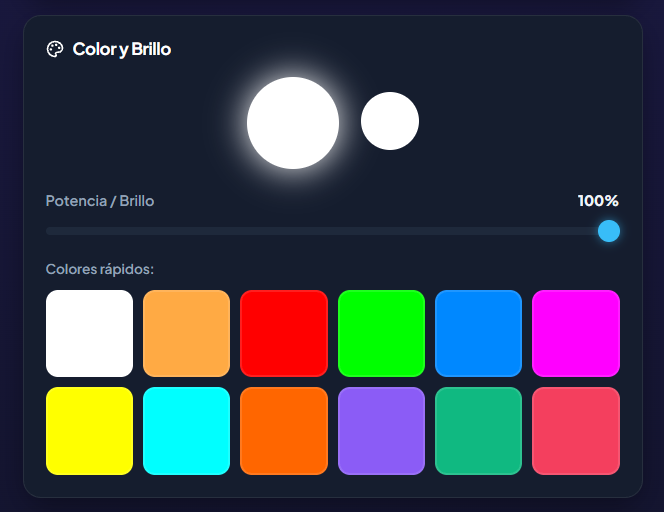
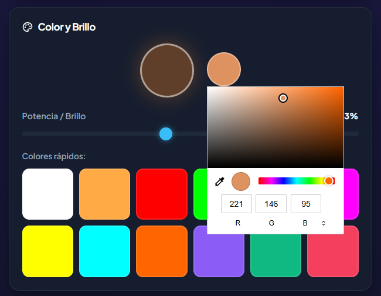
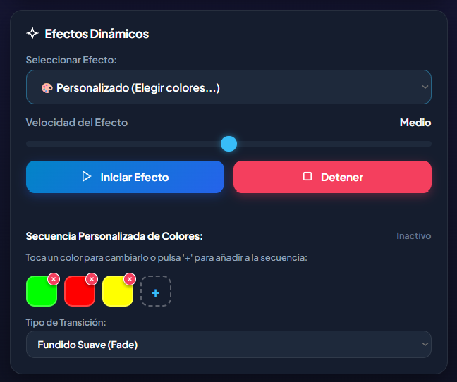
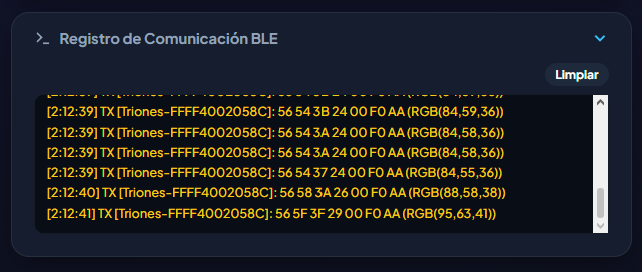



  
  
  # 💡 BrightLight

  ### **Controlador Web Bluetooth para bombillas y tiras LED (Triones / HappyLighting / IP66)**

  
  
  
  

   

  ## 🚀 **[👉 ABRIR APLICACIÓN WEB EN VIVO](https://paucg06.github.io/BrightLight-Bluetooth/)**
  *Compatible con Google Chrome, Microsoft Edge y Opera en Windows, macOS, Linux y Android.*

   

---

## 📸 Demostración Visual

### 🔌 1. Conexión Bluetooth & Control Multi-Luz
Emparejamiento en un clic mediante Web Bluetooth. Permite conectar y gestionar múltiples bombillas simultáneamente de forma sincronizada o individual.

  

 

---

### 🎨 2. Control de Color y Potencia
Selector cromático completo con vista previa de brillo neón en tiempo real y paleta rápida de 12 colores esenciales.

  <table>
    <tr>
      <td width="50%" align="center">
        <strong>Paleta Rápida & Brillo</strong>  
        
      </td>
      <td width="50%" align="center">
        <strong>Selector Cromático Completo</strong>  
        
      </td>
    </tr>
  </table>

 

---

### 🌈 3. Efectos Dinámicos y Creador de Secuencias Custom
Modos predefinidos (*Arcoíris*, *Salto de colores*, *Estrobo*, *Pulso*) y un **Creador de Secuencias** para encadenar tus propios colores (ej. Verde ➔ Rojo ➔ Amarillo) con transiciones suaves (*Fade*, *Jump* o *Flash*) reguladas por velocidad.

  

 

---

### 📡 4. Registro de Comunicación BLE en Tiempo Real
Consola de diagnóstico minimalista e integrada para inspeccionar cada byte transmitido al controlador GATT de la bombilla.

  

 

---

## ⚡ Características Clave

* 🌐 **100% en el Navegador**: Sin Node.js, sin Python y sin controladores adicionales.
* 💡 **Protocolo Triones / HappyLighting**: Comunicación directa sobre el servicio `0xFFD5` y la característica de escritura `0xFFD9`.
* 🎛️ **Regulación Precisa**: Control de potencia del 1% al 100% y velocidad ajustable en tiempo real.
* 📱 **PWA & Responsive**: Diseño oscuro moderno optimizado para PC de escritorio, portátiles y smartphones.

---

## 🌐 Cómo usarlo con GitHub Pages

1. Abre el enlace del proyecto: **[https://paucg06.github.io/BrightLight-Bluetooth/](https://paucg06.github.io/BrightLight-Bluetooth/)**
2. Pulsa en **"Conectar Luz"** y selecciona tu bombilla Bluetooth en la ventana emergente.
3. ¡Listo! Ya puedes controlar los colores y la potencia al instante.

---

## 📄 Licencia

Distribuido bajo la Licencia **MIT**. Consulta `LICENSE` para más información.
